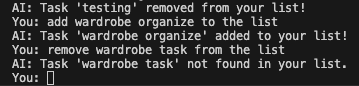

AI powered todo application

Things we need:
 - task addtion, removal and updation
 - due date

Issues: 
 - Asking the agent to update an existing task using task name is tough for user, because the entity extraction requires proper input of the task. For instance:
    
    - Hence, its easy for user if the list is shown as a UI and user can just remove it with one tap.

